# Quick summary

## Convergences

For the basic simulation parameters, the convergence criteria is 1e-4 eV.
For the GW parameters, it is only 1e-2 eV, since the error of GW is probably already larger than this, and the smaller criteria makes calculation much faster.

Energy cutoff `ecuteps=46` and grid size `ngkpt=10`:

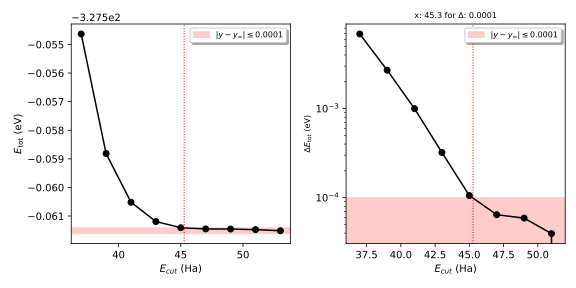
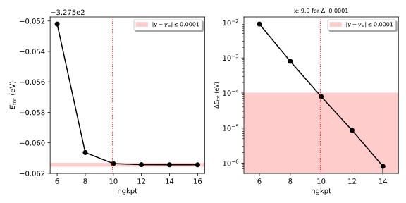

Energy cutoff `ecuteps=12` and number of bands `nband=30` used to calculate $\epsilon$:

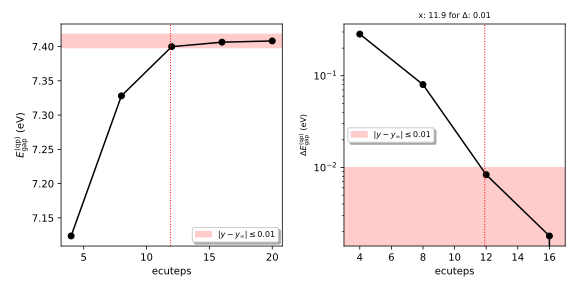
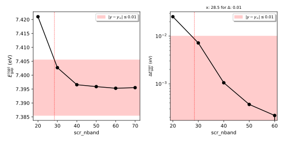

Energy cutoff `ecutsigx=12` (to at least match `ecuteps`) and number of bands `nband=30` used to calculate the self energy:

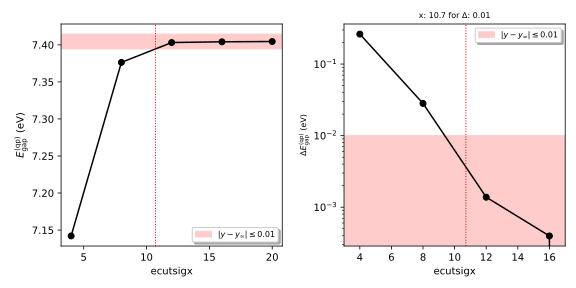
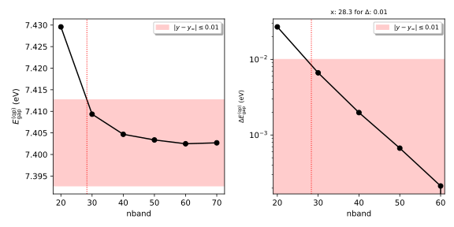

Cell size convergence for the single carbon atom.

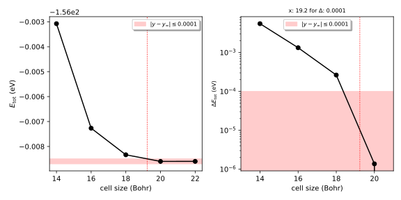

## Atomization energy

- the energy of a single atom is -156.008 eV
- the GS calculation gives -327.562 eV

So the atomization energy is 7.773 eV / atom.
Other calculations usually report a value around 7.5 eV

## Diamond band structure calculations

Points and edges of the path in red and blue,
and the generated k-grid used in the GS calculation in orange:

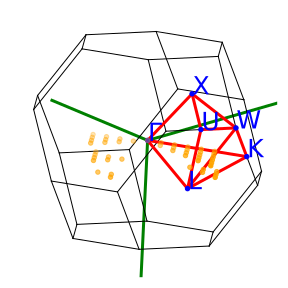

The KS band structure on the left, and the band structure corrected with the GW approximation on the right.
The GW corrected indirect band gap comes close to the experimental values around 5.5 eV.

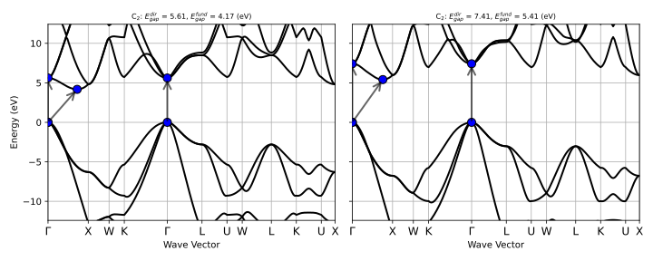

The KS and GW corrected band structure plotted over one another:

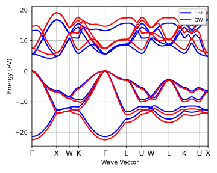

The valence band of the cubic diamond cell, with the band of the primitive cell plotted over it for reference.
The k-path labels are with respect to the primitive BZ, and the path itself is the same as plotted before.
As expected, the bands are folded into the smaller BZ of the cubic cell, and there are 4 times more states for the 4 times as many atoms.

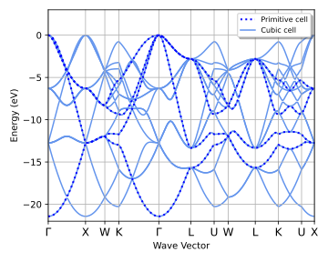

## NVC-

Band structure of a NVC- in a cubic cell of diamond,
with the same path as plotted before.
This cell size appeares to be too small to get a meaningful result.
The band structure is distorted, and while there seem to be orbitals between the original valence and conduction bands (around 0 eV on the plot), they are not localized at all.

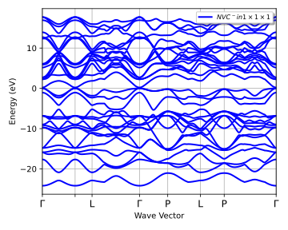

Isolated states between the conduction and valence bands of a NVC- in a 2x2x2 supercell of diamond.
Here, the orbitals are fairly localized, and can be identified easily,
but their dispersion relation is still not flat.
Hardware limitations only allowed for a smaller path.

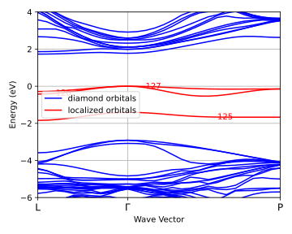

The densityof the localized orbitals at the gamma point is plotted with an isosurface of 11 (presumeably in A^(-3))

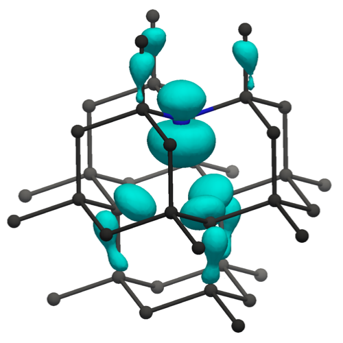
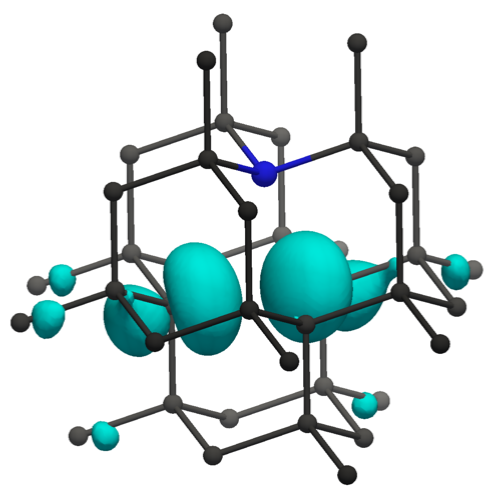
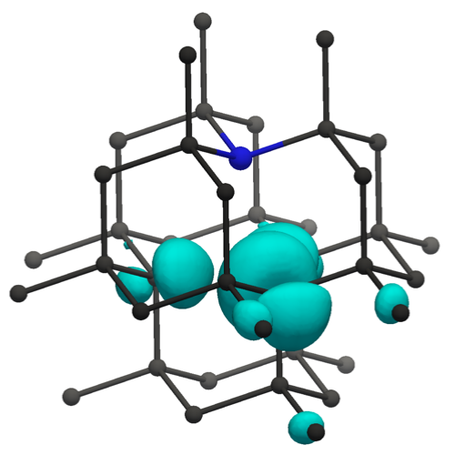
